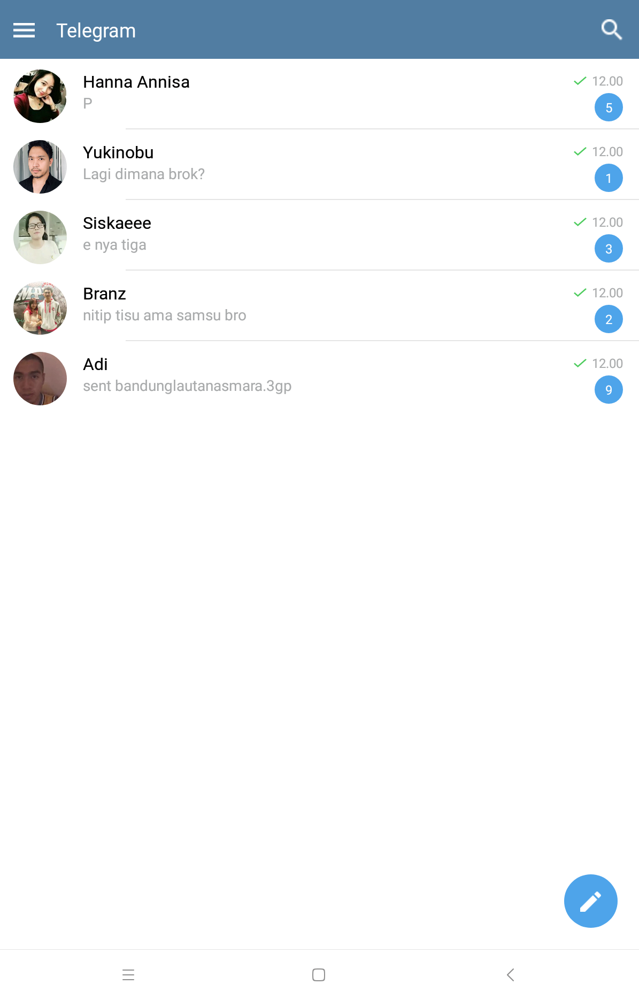

# Telegram Layout

 <br>


This layout was developed using Figma + React Native

## Development Server
```
# Run Development Server
npm start

# Run Development in Web
npm run web / snack.expo.io

# Requirements
- Android device with OS version at least 5.0 Lollipop
- Activate developer mode
- Activate USB debugging
```


